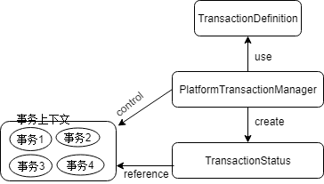

# Spring的事务管理

## 事务的基础知识

### 什么时事务

一荣俱荣，一损俱损非常形象的比如了事务，事务要么整体成功，要么整体失败。
事务的ACID

+ 原子性(ATOM)
+ 一致性(consistency)
+ 隔离性(Isolation)
+ 持久性(Durabiliy)

### 数据并发问题

+ 脏读(dirty read) A事务读取B事务尚未提交的更改数据，A事务读取的数据不能保证持久。
+ 不可重复读(unrepeatable read) A事务读取了B事务已经提交的更改数据。A事务应该读取B事务之前的数据
+ 幻象读(phantom read) A事务读取B事务提交的新增数据。
+ 第一类丢失更新 A事务撤销时把已经提交的B的事务的更新数据覆盖了
+ 第二类丢失更新 A事务覆盖B事务已经提交的数据

**幻象读读到了其他已经提交事务的新增数据**，**不可重复读是指读到了已经提交事务的更改数据(更改或者删除)**
不可重复读只用采取添加行级锁，阻止操作中的数据发生变化
幻象读只能添加表级锁防止新增数据。

### 数据库的锁机制

数据库通过锁机制解决并发访问的问题。按照锁定的对象的不同，分为表锁定和行锁定。
从并发事务锁定的关系上看，分为共享锁定和独占锁定。共享锁定会防止独占锁定但运行其他的共享锁定，独占锁定防止其他独占锁定和其他的共享锁定。
INSERT，UPDATE，DELETE和SELECT FOR UPDATE采用行锁定

### 事务隔离级别

数据库为用户提供了自动锁机制，只要用户指定会话的事务隔离级别，数据库就会分析事务中的SQL语句，自动为事务操作的数据资源添加适合的锁。
SQL92定义了4个级别的事务隔离

|隔离级别|脏读|不可重复读|幻象读|第一类丢失更新|第二类丢失更新|
|-------|----|---------|------|------------|-------------|
|READ UNCOMMITED|Y|Y|Y|N|Y|
|READ COMMITED|N|Y|Y|N|N|Y|
|REPEATABLE READ|N|N|Y|N|N|
|SERIALIZABLE|N|N|N|N|N|

### JDBC对事务的支持

```java
Connection conn = ds.getConnection();
System.out.println("supportsTransactions:"+conn.getMetaData().supportsTransactions());//显式数据库是否支持事务
System.out.println("supportsTransactionIsolationLevel1："+conn.getMetaData().supportsTransactionIsolationLevel(1));//是否支持事务级别
```

简单的事务提交

```java
Connection conn;
try{
    conn = DriverManager.getConnection();
    conn.setAutoCommit(false);//关闭自动提交
    conn.setTransactionIsolation(Connection.TRANSACTION_SERIALIZABLE);
    Statement stmt = conn.createStatement();
    //....
    conn.commit();
}catch(Exception e){
    ...//处理异常
    conn.rollback();
}finally{
    //
}
```

### Spring对事务管理的支持

Spring为事务管理提供了一致的编程模板，在高层次建立了统一的事务抽象。不管时JDBC,Hibernate，JPA等使用统一的编程模型进行事务管理。

#### 事务管理关键抽象

Spring事务管理SPI的抽象层主要包括3个接口:`PlatformTransactionManager`,`TransactionDefinition`,`TransactionStatus`.



TransactionDefinition用于事务隔离级别，超时时间，是否为只读事务，事务传播规则，通过xml配置或者注解，编程等方式提供。

PlatformTransactionManager根据TransactionDefinition提供的事务属性配置信息创建事务，并用TransactionStatus描述这个激活事务的状态。

1. TransactionDefinition

+ 事务隔离:4种事务隔离，常年在java.sql.Connection接口中，其中ISOLATION_DEFAULT表示默认级别，由数据库直接定义。
+ 事务传播:通常在一个事务中执行的所有代码都会运行于同一个事务上下文中。Spring提供了几个事务传播类型
+ 事务超时:事务在超时前能运行多久，超过时间后，事务被回滚。TIMEOUT_DEFAULT之外的其他值，则将抛出异常。
+ 只读状态:只读事务不修改任何数据，当它修改数据后就抛出异常。

2. TransactionStatus

代表一个事务的具体运行状态。事务管理器可以通过该接口获取事务运行期间的状态信息。

`boolean hasSavepoint()`判断当前事务是否在内部创建一个保存点。
`boolean isNewTransaction()` 判断当前事务是否是一个新的事务，如果返回false，则表示当前事务是一个已经存在的事务，或者当前操作未运行在事务环境中。
`boolean isCompleted()` 判断当前事务是否已经结束
`boolean isRollbackOnly()` 判断当前事务是否已经被标识为rollback-only

3. PlatformTransactionManager

`getTransaction(TransactionDefinition definition)` 返回事务定义对应的事务状态，或者创建一个新的事务
`commit(TransactionStatus status)` 提交事务，如果status设置了rollback-only，就执行一个回滚事务的操作
`rollback(TransactionSatatus status)` 提交抛出异常时rollback方法会被隐式调用。

#### 事务同步管理器

`SynchronizationManager`使用ThreadLocal为不同事务线程提供了独立的资源副本，同事维护事务配置的属性和运行状态信息。

#### 事务传播行为

当事务运行中出现多个调用服务，Spring通过过事务传播行为控制当前的事务如果传播到被嵌套调用的目标服务接口方法中。

Spring在TransactionDefinition接口定义了7种类型的事务传播行为

|事务传播行为类型|说明|
|---------------|---|
|PROPAGATION_REQUIRED|没有事务，新建一个事务，已经存在一个事务，则加入到事务中|
|PROPAGATION_SUPPORTS|支持当前事务，没有事务就以非事务运行|
|PROPAGATION_MANDATORY|使用当前事务，如果没有事务就抛异常|
|PROPAGATION_REQUIRES_NEW|新建事务，如果已经存在事务则把当前事务挂起|
|PROPAGATION_NOT_SUPPORTED|以非事务方式执行，如果当前存在事务，则挂起当前事务|
|PROPAGATION_NEVER|以非事务方式执行，如果当前存在事务，则抛异常|
|PROPAGATION_NESTED|如果当前存在事务，则在嵌套事务内执行，如果没有当前事务，则执行PROPAGATION_REQUIRED类似操作|